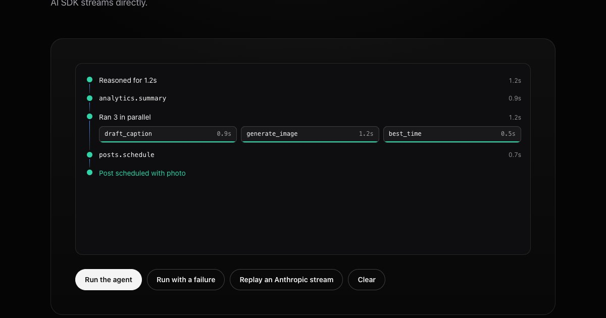

# Trace

An agent run timeline. **Reasoning** streams in and folds away, **tool calls**
show their input and output, **parallel** calls run side by side with their
own progress, and **failures** offer a retry. Adapters read OpenAI, Anthropic
and Vercel AI SDK streams directly.

**[→ Live demo](https://yagnikbarasiya23.github.io/trace-agent-timeline/)**



Zero dependencies.

## Run it

You need [Node.js](https://nodejs.org) 20.19 or newer.

```bash
git clone https://github.com/YagnikBarasiya23/trace-agent-timeline.git
cd trace-agent-timeline
npm install
npm run dev
```

```bash
npm test          # step rules, formatting and the three stream adapters
npm run build     # → dist/
npm run preview   # serve what you just built
```

## What's in here

| File | What it does |
| --- | --- |
| `trace.js` | The component: step rules, the stream adapters and the timeline UI |
| `trace.css` | Layout, connectors, lanes and the reduced-motion fallback |
| `index.html`, `style.css`, `app.js` | The demo page |
| `test/trace.test.js` | Step transitions, durations, JSON summaries and grouping |
| `test/adapters.test.js`, `test/fixtures/` | Each adapter against a recorded stream |

Only `trace.js` and `trace.css` are needed in your project.

## Use it

Give the element a height; it scrolls.

```html
<link rel="stylesheet" href="trace.css">
<div id="trace" style="height: 360px"></div>

<script type="module">
  import Trace from './trace.js';

  const trace = new Trace(document.querySelector('#trace'));

  const think = trace.reasoning();
  think.append('Check last month first…');
  think.done();                                   // → "Reasoned for 1.3s"

  const call = trace.tool('analytics.summary', { args: { days: 30 } });
  call.done({ result: { reach: 7200 } });         // or call.fail('Timed out')

  const group = trace.parallel();
  group.tool('draft_caption');
  group.tool('generate_image').progress(0.4);

  trace.finish('Post scheduled');
  trace.on('retry', step => { step.retry(); /* run it again, then step.done() */ });
</script>
```

### From a model stream

```js
// OpenAI Responses API
const stream = await openai.responses.create({ model, input, tools, stream: true });
await trace.fromEvents(stream, { format: 'openai', runTool: (name, args) => tools[name](args) });

// Anthropic Messages API
const stream = anthropic.messages.stream({ model, messages, tools, thinking: { type: 'enabled', budget_tokens: 2000 } });
await trace.fromEvents(stream, { format: 'anthropic', runTool: (name, args) => tools[name](args) });

// Vercel AI SDK: tools run on the server and their results arrive in the stream
const result = streamText({ model, prompt, tools });
await trace.fromEvents(result.fullStream, { format: 'ai-sdk' });
```

`runTool` is optional. Without it, tool steps stay running until you call
`trace.get(id).done({ result })` yourself. Tools that start before the
previous one finishes are grouped into one parallel step.

## API

| Member | What it does |
| --- | --- |
| `reasoning({ id? })` | A streaming reasoning step; `append(text)`, then `done()` collapses it |
| `tool(name, { id?, args? })` | A tool call; `args(value)`, `done({ result })`, `fail(message)`, `cancel()` |
| `parallel(name?)` | A group; `group.tool(...)` adds lanes, `lane.progress(0–1)` fills a lane's bar |
| `message(text)` | A plain note in the timeline |
| `finish(text?)` / `error(message)` | Ends the run |
| `get(id)` | Finds a step by id |
| `on('retry' \| 'toggle', fn)` | Returns an unsubscribe function. Retry hands you the failed step; call `step.retry()` |
| `fromEvents(stream, { format, runTool? })` | `format` is `openai`, `anthropic` or `ai-sdk` |
| `clear()` / `destroy()` | Empties the timeline / removes everything Trace added |

Colours come from `--trace-accent`, `--trace-done` and `--trace-fail`; lines
and muted text follow the element's `color`, so it works on light and dark
backgrounds.

## How it works

**Strict step states.** A step is running, then done, failed or cancelled.
Only a failed step can go back to running, through `retry()`. Illegal moves
throw, so bugs in the calling code show up straight away.

**Adapters are pure.** Each provider's events are mapped to a small set of
operations (`reasoning.append`, `tool.start`, `tool.args`…) by a pure
function, tested against recorded streams. The timeline only knows those
operations. Anthropic runs that stop for a tool call continue in the next
message and finish only at the real end of the turn.

**One clock.** A single 100 ms interval updates every running step's timer
and stops when nothing is running.

**Scroll that respects the reader.** The timeline follows new steps while you
are at the bottom. Scroll up and it stops, showing a "Jump to latest" pill.

**Accessible.** Steps are a list; each header is a button with
`aria-expanded`. A polite live region announces when a tool finishes or
fails and when the run ends. Reduced motion removes the slide, pulse and
shimmer.

## License

MIT © 2026 Yagnik Barasiya
